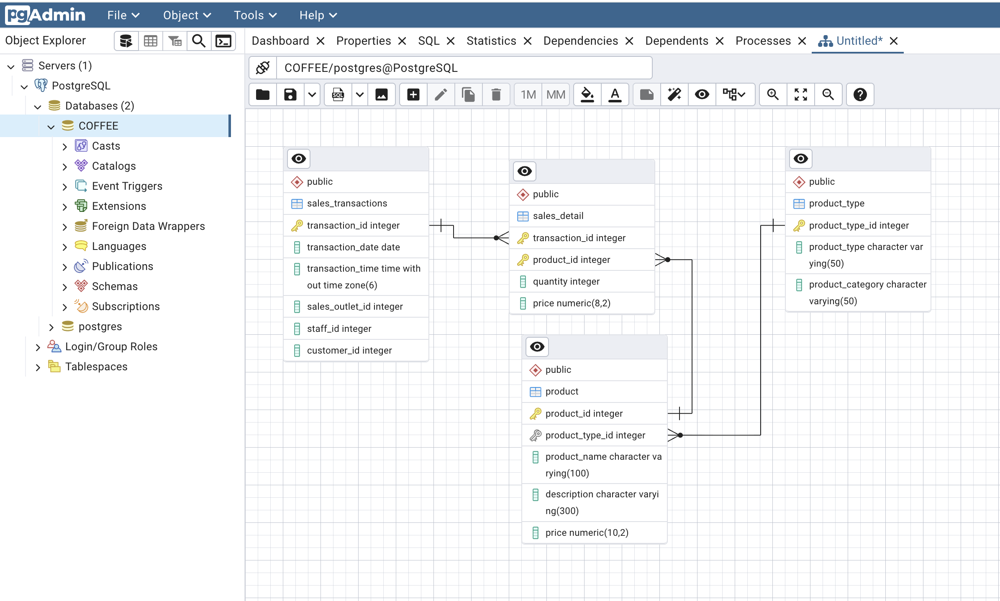
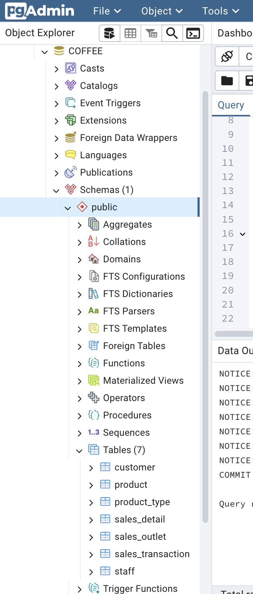
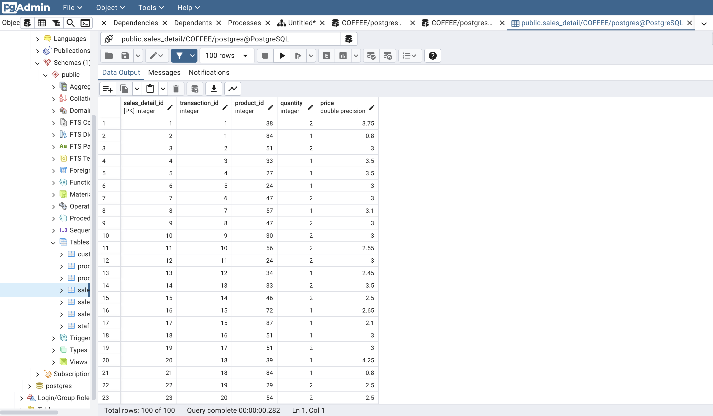
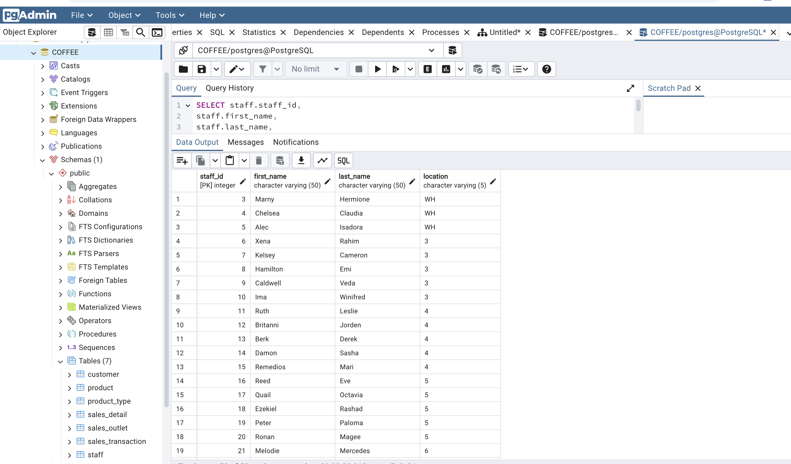
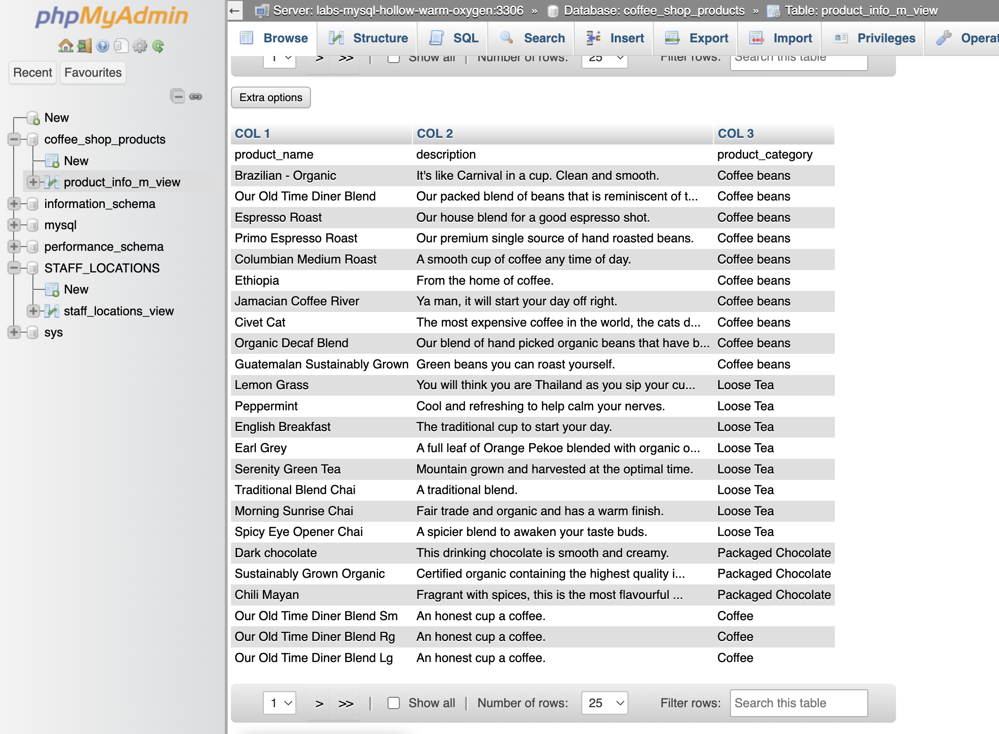
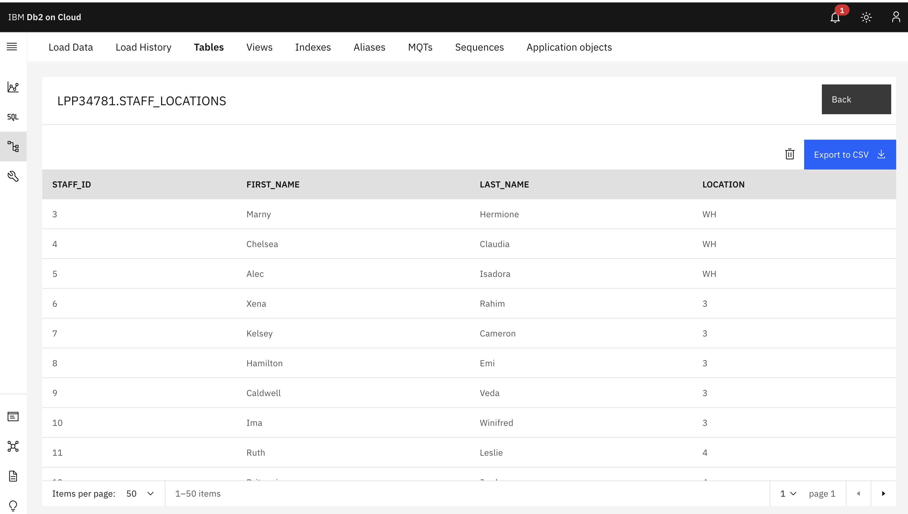

# Coffee Shop Data Infrastructure Project

## Project Overview

This project simulates the design and implementation of a centralised data infrastructure for a coffee shop chain undergoing national expansion.

The business required consolidation of data from multiple sources — including point-of-sale systems, spreadsheets, and supplier data — into a structured relational database to support operational efficiency and data-driven decision making.

## Database Design

A relational schema was designed using an Entity Relationship Diagram (ERD), with a focus on normalisation, referential integrity, and scalability. The design separates transactional data from product and organisational data to reduce redundancy and ensure consistency.

## Technologies Used

* PostgreSQL (database implementation)
* pgAdmin (database management)
* MySQL / phpMyAdmin (data integration)
* IBM Db2 Cloud (cloud-based data loading)

## Schema Implementation

The database was implemented in PostgreSQL using SQL DDL statements. Key entities include:

* staff
* sales_outlet
* customer
* product
* product_type
* sales_transaction
* sales_detail

Foreign key constraints were applied to enforce relationships between transactional and reference data.

## Data Loading and Validation

Sample data representing sales transactions and operational records was loaded into the database. Queries were executed to validate data integrity and ensure correct relationships between tables.

## Data Transformation (Views)

A view was created to support a payroll use case, providing a filtered dataset of staff and their assigned locations while excluding executive roles.

## Performance Optimisation (Materialised View)

A materialised view was implemented to optimise queries combining product and category data. This reduces query execution time for repeated analytical queries.

## Data Export and Integration

Processed datasets were exported to CSV format and integrated into external systems, including MySQL and IBM Db2, demonstrating cross-platform data movement.

## Key Skills Demonstrated

* Relational database design and normalisation
* SQL (DDL, joins, and query optimisation)
* Implementation of primary and foreign key constraints
* Use of views and materialised views for data transformation and performance
* Data export and integration across multiple database systems
* Working with PostgreSQL, MySQL, and cloud-based databases

## Future Improvements

* Automate data ingestion and export processes using Python (e.g. pandas and SQL connectors)
* Introduce an ETL pipeline to orchestrate data movement between systems
* Extend the schema to support additional business use cases (e.g. inventory tracking or supplier management)
* Implement indexing strategies to improve query performance on large datasets
* Containerise the database environment using Docker for reproducibility
* Integrate with a data visualisation tool (e.g. Power BI or Tableau) for reporting

---
