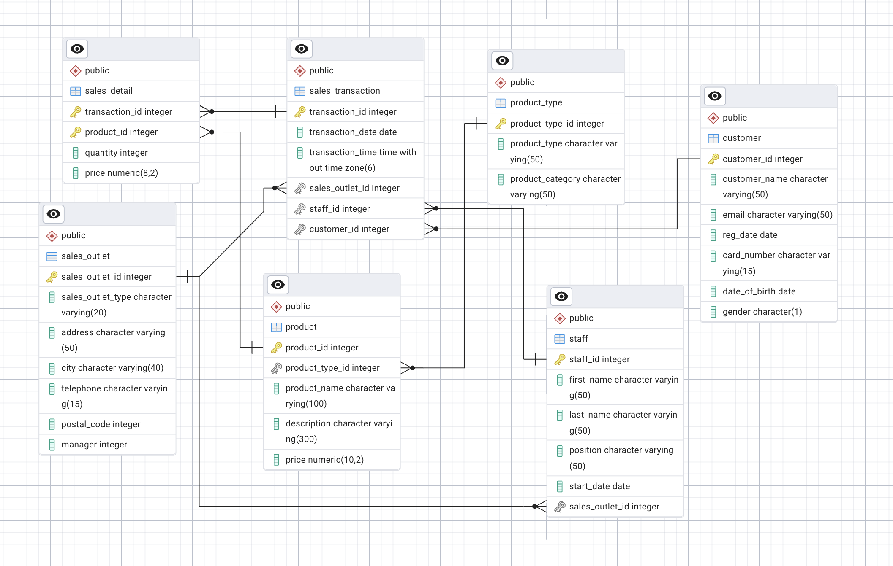

# Coffee Shop Data Engineering Project

## Overview

This project focuses on the design and implementation of a relational database for a coffee shop chain expanding its operations. The objective is to consolidate data from multiple sources into a structured and scalable database that supports operational efficiency and data-driven decision-making.

The work includes both schema design and data modelling, with a focus on transforming an initially denormalised dataset into a well-structured relational model.

---

## Data Modelling Approach

The original dataset contained several denormalised structures, including:

* Transaction records containing product, quantity, and price information within a single table
* Product data combining category and type attributes
* Staff location stored as a text field

The schema was redesigned to achieve third normal form (3NF):

* Created a `sales_detail` table to separate line items from transactions
* Introduced a `product_type` table to eliminate repeated categorical data
* Replaced text-based location fields with a foreign key (`sales_outlet_id`) in the `staff` table

This transformation improves:

* Data integrity
* Scalability
* Query performance
* Maintainability of the database

---

## Database Design

The final schema follows a normalised relational model with clear separation between transactional and master data.

Key design features:

* Use of primary and foreign keys to enforce relationships
* Fully connected entity structure
* Removal of redundant attributes
* Support for multi-location operations

---

## Entity Relationship Diagram



---

## Tables

The database consists of the following core tables:

* `sales_transaction` – records each transaction
* `sales_detail` – line-level transaction data
* `product` – product catalogue
* `product_type` – product classification
* `customer` – customer information
* `staff` – employee records
* `sales_outlet` – store locations

---

## Example Queries

### Revenue by Sales Outlet

```sql
SELECT 
    so.sales_outlet_id,
    so.city,
    SUM(sd.quantity * sd.price) AS total_revenue
FROM sales_detail sd
JOIN sales_transaction st ON sd.transaction_id = st.transaction_id
JOIN sales_outlet so ON st.sales_outlet_id = so.sales_outlet_id
GROUP BY so.sales_outlet_id, so.city
ORDER BY total_revenue DESC;
```

### Top Selling Products

```sql
SELECT 
    p.product_name,
    SUM(sd.quantity) AS total_sold
FROM sales_detail sd
JOIN product p ON sd.product_id = p.product_id
GROUP BY p.product_name
ORDER BY total_sold DESC
LIMIT 5;
```

---

## Technologies Used

* PostgreSQL
* pgAdmin (schema design and ERD generation)
* SQL

---

## Future Improvements

* Add indexing strategies for performance optimisation
* Implement constraints for stricter data validation
* Introduce analytical views for reporting
* Extend schema to include inventory and supply chain data

